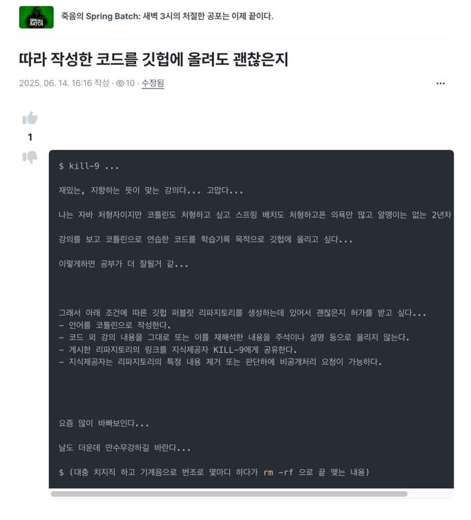
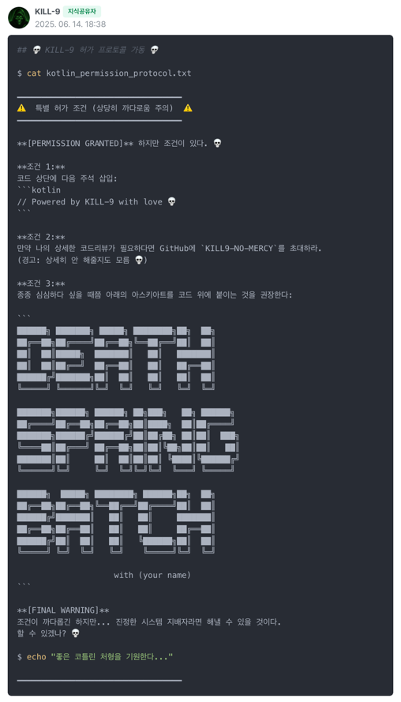

```
██████╗ ███████╗ █████╗ ████████╗██╗  ██╗
██╔══██╗██╔════╝██╔══██╗╚══██╔══╝██║  ██║
██║  ██║█████╗  ███████║   ██║   ███████║
██║  ██║██╔══╝  ██╔══██║   ██║   ██╔══██║
██████╔╝███████╗██║  ██║   ██║   ██║  ██║
╚═════╝ ╚══════╝╚═╝  ╚═╝   ╚═╝   ╚═╝  ╚═╝

███████╗██████╗ ██████╗ ██╗███╗   ██╗ ██████╗ 
██╔════╝██╔══██╗██╔══██╗██║████╗  ██║██╔════╝ 
███████╗██████╔╝██████╔╝██║██╔██╗ ██║██║  ███╗
╚════██║██╔═══╝ ██╔══██╗██║██║╚██╗██║██║   ██║
███████║██║     ██║  ██║██║██║ ╚████║╚██████╔╝
╚══════╝╚═╝     ╚═╝  ╚═╝╚═╝╚═╝  ╚═══╝ ╚═════╝ 

██████╗  █████╗ ████████╗ ██████╗██╗  ██╗
██╔══██╗██╔══██╗╚══██╔══╝██╔════╝██║  ██║
██████╔╝███████║   ██║   ██║     ███████║
██╔══██╗██╔══██║   ██║   ██║     ██╔══██║
██████╔╝██║  ██║   ██║   ╚██████╗██║  ██║
╚═════╝ ╚═╝  ╚═╝   ╚═╝    ╚═════╝╚═╝  ╚═╝

                    with MASKUN2
```

# 스프링 배치 연습 프로젝트 : 인프런 KILL-9의 강의

[강의링크](https://www.inflearn.com/course/%EC%A3%BD%EC%9D%8C%EC%9D%98-spring-batch)

- 강의가 자바로 되어있어서 코틀린으로 바꿔서 만들어보는 개인 학습기록용 프로젝트입니다.
- 강의가 좋습니다. 추천드립니다 :)

# 프로젝트를 생성하는 목적
- 코틀린으로 변환하는 과정에서 코드를 더 잘 이해할 것 같았습니다.
- 학습한 기록을 남기려고 했습니다.


# 코드 게시에 대한 인프런 지식제공자와의 질의응답 내용

