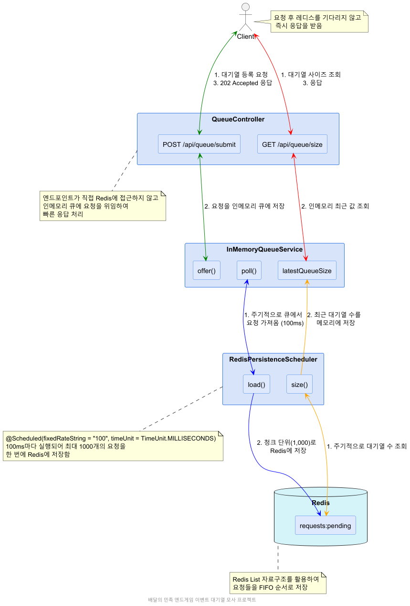

# 프로젝트 설명
1. 배달의 민족 엔드게임 이벤트 대기열 기능 모사 연습 프로젝트입니다.
2. 이 프로젝트의 모티브는 유투브영상 "title": "[우아한테크토크] 엔드게임 이벤트 긴급 대응기  개발자 어!셈블?",
   "url": "https://www.youtube.com/watch?v=uWcn7omddxs" 에서 영감을 얻었습니다. 영감주신 김재민님(감사하게도 링크드인 1촌을 받으셨음) 및 영상을 공개해주신 배달에 민족께 감사합니다.
3. 당초 50,000 TPS를 견뎌내는 대기열 프론트 서버를 로컬에서 구축해보자! 가 목표였으나 테스팅 규모를 개인 노트북 안에서 해야해서 축소하였습니다.
4. 대신 핵심 솔루션이었던 웹 요청을 인메모리에 쌓고 청크단위로 Redis에 적재하는 로직을 모사해보았습니다. 즉 Redis에 전달되는 네트워크 입력 부하를 레귤레이션 하는 로직이 대상입니다.

## 프로젝트 설명
이 프로젝트는 배달의 민족 엔드게임 이벤트 대기열 기능을 모사한 연습 프로젝트입니다. 핵심 아키텍처는 다음과 같습니다:
1. **클라이언트 요청 처리**:
   - REST API(`/api/queue/submit`)를 통해 클라이언트 요청을 받습니다.
   - 요청은 곧바로 인메모리 큐()에 저장됩니다. `InMemoryRequestQueue`
   - 클라이언트는 즉시 202 Accepted 응답을 받습니다.

2. **인메모리 큐**:
   - 를 사용하여 스레드 안전하게 요청을 관리합니다. `ConcurrentLinkedQueue`
   - 요청을 추가(), 추출(), 확인() 기능을 제공합니다. `offer``poll``peek`
   - 주기적으로 큐 크기를 모니터링합니다.

3. **Redis 영구 저장소**:
   - 가 100ms마다 주기적으로 실행됩니다. `RedisPersistenceScheduler`
   - 인메모리 큐에서 최대 1000개의 요청을 한 번에 가져옵니다(청크 단위).
   - Redis 파이프라이닝을 활용하여 효율적으로 Redis에 저장합니다.
   - Redis의 List 자료구조(`requests:pending`)를 사용하여 FIFO 방식으로 관리합니다.

이 아키텍처는 Redis에 직접 접근하는 대신 인메모리 큐를 중간에 두어 Redis로 가는 네트워크 입력 부하를 조절하는 방식으로, 고부하 상황에서도 안정적인 요청 처리를 가능하게 합니다.

