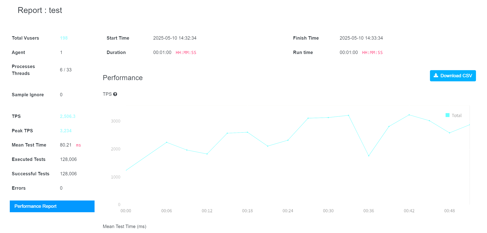
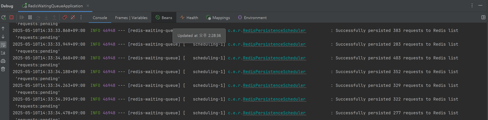

# 프로젝트 설명
1. 배달의 민족 엔드게임 이벤트 대기열 기능 모사 연습 프로젝트입니다.
2. 이 프로젝트의 모티브는 유투브영상 "title": "[우아한테크토크] 엔드게임 이벤트 긴급 대응기  개발자 어!셈블?",
   "url": "https://www.youtube.com/watch?v=uWcn7omddxs" 에서 영감을 얻었습니다. 영감주신 김재민님(감사하게도 링크드인 1촌을 받으셨음) 및 영상을 공개해주신 배달에 민족께 감사합니다.
3. 당초 50,000 TPS를 견뎌내는 대기열 프론트 서버를 로컬에서 구축해보자! 가 목표였으나 테스팅 규모를 개인 노트북 안에서 해야해서 축소하였습니다.
4. 대신 핵심 솔루션이었던 웹 요청을 인메모리에 쌓고 청크단위로 Redis에 적재하는 로직을 모사해보았습니다. 즉 Redis에 전달되는 네트워크 입력 부하를 레귤레이션 하는 로직이 대상입니다.
5. 

